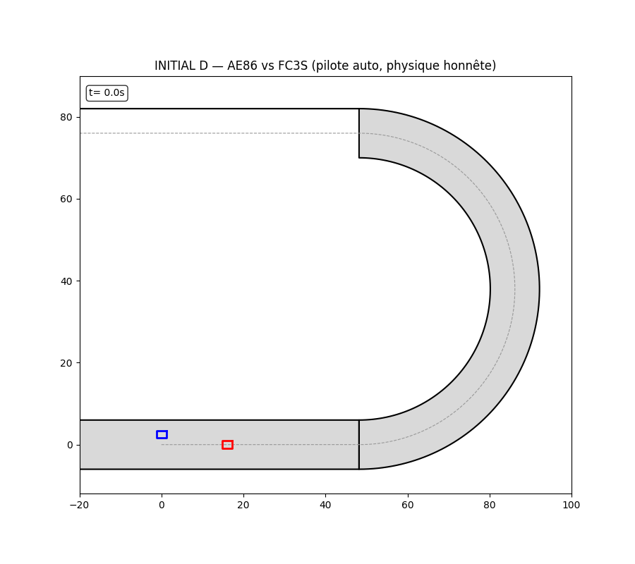
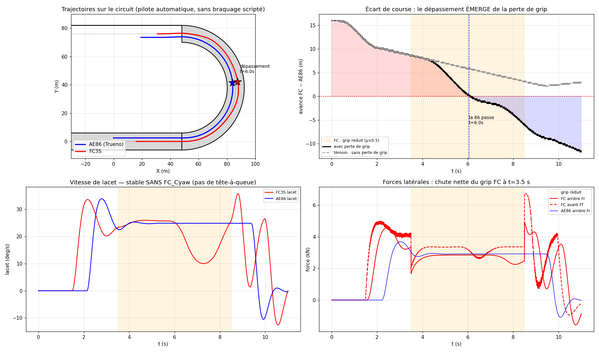

# 🏎️ Simulateur de dynamique véhicule — Modèle bicyclette & duel AE86 vs FC3S

Simulateur de dynamique automobile sous **MATLAB**, du modèle linéaire académique
jusqu'à un **duel de course qui émerge de la physique** — sans trajectoire scénarisée
ni artifice numérique.



> Toyota **AE86** (bleu) vs Mazda **FC3S** (rouge). La FC part en tête. À `t = 3.5 s`
> elle perd son adhérence : elle sous-vire, doit lever le pied, et la 86 la double
> **à la corde**. Rien de tout cela n'est scripté — voir [Le duel](#-le-duel--une-course-qui-émerge-de-la-physique).

---

## Sommaire

- [Contexte](#contexte)
- [Les trois modèles](#les-trois-modèles)
- [Le duel : une course qui émerge de la physique](#-le-duel--une-course-qui-émerge-de-la-physique)
- [Rapport](#-rapport)
- [Structure du dépôt](#structure-du-dépôt)
- [Lancer la simulation](#lancer-la-simulation)
- [Le modèle physique](#le-modèle-physique)
- [Réglages](#réglages)
- [Limites & pistes d'amélioration](#limites--pistes-damélioration)
- [Auteur](#auteur)

---

## Contexte

Projet du module **Performance et Comportement Dynamique des Véhicules**
(SeaTech — Université de Toulon). L'objectif : coder un simulateur qui reproduit le
comportement d'une voiture le plus fidèlement possible à partir du **modèle bicyclette**,
pour comprendre concrètement la physique du lacet, de la dérive et du transfert
d'adhérence.

Le travail est découpé en trois étapes, de la plus simple à la plus réaliste.

---

## Les trois modèles

| Fichier | Modèle de pneu | Ce qu'il montre |
|---|---|---|
| **`Voiture.m`** | Linéaire (`F = −C·α`) | Base théorique : réponse en virage, stabilité, sous-virage naturel |
| **`Voiture_Saturation.m`** | Saturation à la limite (`F_max = μ·F_z`) | Comportement aux limites d'adhérence (mise en glisse, décrochage) |
| **`Battle.m`** | Pacejka (formule magique) | **Duel de course en boucle fermée** (voir ci-dessous) |

Chaque script produit les tracés physiques usuels (trajectoire, vitesse de lacet,
angle de dérive au CdG, dérives aux essieux, efforts latéraux, vitesses longitudinale
et latérale) et une animation.

---

## 🏁 Le duel : une course qui émerge de la physique

`Battle.m` oppose une **Toyota AE86** et une **Mazda FC3S** dans un virage en épingle
(rayon 38 m). C'est le cœur du projet, et il a été entièrement repensé pour être
**physiquement honnête** : le résultat de la course n'est pas écrit à l'avance, il
**sort du calcul**.

### Trois mécanismes réels, zéro triche

| Approche naïve (scénarisée) | Approche de ce projet (émergente) |
|---|---|
| Braquage écrit à la main, image par image | **Pilote automatique** (contrôleur *Stanley*) : le braquage est *calculé* à chaque pas à partir de l'écart à la trajectoire |
| Amortisseur de lacet artificiel pour éviter le tête-à-queue | **Aucun terme de lacet** : la stabilité vient uniquement du pilote qui suit sa ligne et gère sa vitesse |
| Vitesses réglées à la main pour forcer le dépassement | **Vitesse limitée par l'adhérence** disponible ; le pilote lève le pied s'il sent la voiture partir large |

### Le seul événement scénarisé

À `t = 3.5 s`, l'adhérence de la FC chute (`μ ÷ 2`, pneus usés / surface glissante).
**C'est la seule chose imposée.** Tout le reste découle de la simulation :

```
grip qui chute → la FC sous-vire (ne tourne plus assez) → le pilote lève le pied
pour tenir le virage → elle perd ~1,5 s et tombe à ~42 km/h → la 86, qui a gardé
son adhérence, reste sur la corde et double à ~6 s (+11 m à l'arrivée).
```

### La preuve que ce n'est pas planifié

`Battle.m` simule **aussi la même FC sans la perte d'adhérence** (courbe témoin).

- **Sans** la perte → la FC garde la tête (+3 m). Aucun dépassement.
- **Avec** la perte → la 86 passe.

C'est donc bien la chute d'adhérence — et rien d'autre — qui cause le dépassement.



*De gauche à droite, de haut en bas : trajectoires sur le circuit · écart de course
(témoin vs réel) · vitesse de lacet bornée sans amortisseur artificiel · chute des
efforts latéraux de la FC à t = 3,5 s.*

---

## 📄 Rapport

Le rapport complet du projet — théorie du modèle bicyclette, étude de stabilité,
passage au modèle de Pacejka et analyse détaillée du duel — est disponible ici :

**➡️ [Rapport.pdf](Rapport.pdf)**

---

## Structure du dépôt

```
.
├── Voiture.m               % Modèle bicyclette linéaire
├── Voiture_Saturation.m    % Modèle avec saturation des pneus
├── Battle.m                % Duel AE86 vs FC3S (boucle fermée, émergent)
├── Rapport.pdf             % Rapport complet du projet
├── img/
│   ├── duel.gif            % Animation de la course
│   └── analyse.png         % Planche d'analyse (4 graphes)
└── README.md
```

---

## Lancer la simulation

**Pré-requis :** MATLAB **R2016b ou plus récent** (`Battle.m` utilise des fonctions
locales dans un script). Aucune toolbox particulière n'est nécessaire.

```matlab
% Dans MATLAB, depuis le dossier du dépôt :
Battle.m                 % le duel : ouvre l'analyse + l'animation
Voiture.m                % le modèle linéaire seul
Voiture_Saturation.m     % le modèle avec saturation seul
```

`Battle.m` affiche dans la console l'instant du dépassement, l'écart final, et la
vitesse de lacet maximale de la FC.

---

## Le modèle physique

Modèle **bicyclette** : les deux roues d'un essieu sont regroupées en son centre.
États : cap `ψ`, vitesse de lacet `r = ψ̇`, angle de dérive au CdG `β`. Entrée : angle
de braquage `δ`. Intégration par **méthode d'Euler**.

**Angles de dérive aux essieux**

$$\alpha_f = \beta + \frac{L_f\,r}{u} - \delta \qquad \alpha_r = \beta - \frac{L_r\,r}{u}$$

**Effort latéral — formule magique de Pacejka**

$$F_y = -F_{max}\,\sin\!\Big(C\,\arctan\big(B\alpha - E(B\alpha - \arctan B\alpha)\big)\Big)$$

avec $F_{max} = \mu\,F_z$ et les charges statiques $F_{z,f} = \dfrac{m g L_r}{L}$,
$F_{z,r} = \dfrac{m g L_f}{L}$.

**Équations du mouvement (PFD)**

$$\dot r = \frac{L_f F_f - L_r F_r}{I_z} \qquad \dot\beta = \frac{F_f + F_r}{m\,u} - r$$

**Boucle fermée (le pilote), propre à `Battle.m`**

- *Latéral (Stanley)* — braquage calculé à partir de l'erreur de cap et de l'écart
  latéral `e` à la ligne suivie :
  $$\delta = (\psi_{piste} - \psi) + \arctan\!\frac{k\,e}{u}$$
- *Longitudinal* — vitesse cible bornée par l'adhérence, avec marge :
  $$v_{cible} = \min\!\Big(v_{croisière},\ \sqrt{a_{lat}\,\mu\,g\,R_{local}}\Big)$$
  et réduction supplémentaire (« lever de pied ») dès que la voiture s'écarte de sa ligne.

---

## Réglages

Tout est en tête de `Battle.m` :

| Paramètre | Rôle | Défaut |
|---|---|---|
| `grip.fac` | Sévérité de la perte d'adhérence de la FC (`0.5` = μ÷2) | `0.5` |
| `grip.t0`, `grip.t1` | Fenêtre temporelle de la perte | `3.5 s → 8.5 s` |
| `fc.x0` | Avance de la FC au départ (m) | `16` |
| `ae.line_offset` | Décalage de la ligne intérieure de la 86 (la corde) | `2.5 m` |
| `car.kc` | Contre-braquage pilote optionnel (0 = désactivé) | `0` |

💡 Pour voir le **témoin** par toi-même : mettre `grip.fac = 1` (aucune perte
d'adhérence) et relancer — la FC garde la tête, la 86 ne passe pas.

---

## Limites & pistes d'amélioration

- **Modèle bicyclette** : roulis négligé, charges verticales statiques (pas de
  transfert de charge dynamique en accélération/freinage/virage).
- **Pas de moment d'auto-alignement (SAT)** des pneus : l'ajouter stabiliserait
  encore le lacet de façon purement physique.
- **Intégration d'Euler** : simple mais moins précise qu'un Runge-Kutta ; un pas de
  temps trop grand peut faire osciller les efforts près de la saturation.
- **Ligne de course fixe** : chaque voiture suit une ligne prédéfinie ; un vrai
  planificateur de trajectoire choisirait la ligne dynamiquement.

---

## Auteur

**Tom Hurard** — élève-ingénieur, SeaTech (Université de Toulon).
Projet *Performance et Comportement Dynamique des Véhicules*, 2025.

*Clin d'œil à Initial D 🏔️ pour le duel AE86 vs FC3S.*
